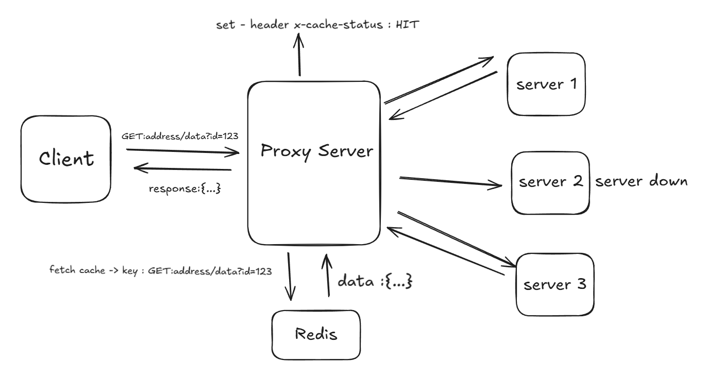
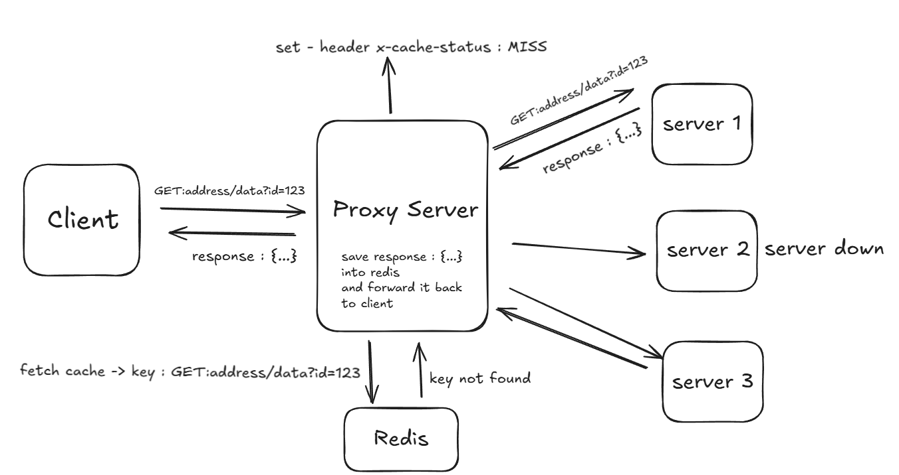

# Proxy Cache Server with Mock Origin

This is a toy project to explore how a **reverse proxy** works, complete with HTTP caching and mock origin servers. It’s built to test caching directives like `must-revalidate`, `stale-while-revalidate`, and `stale-if-error`. The proxy caches responses in **Redis**, handles TTLs, validates freshness, and manages concurrent requests efficiently using a **leader–follower pattern**. Perfect for learning the ins and outs of reverse proxy caching!


---

## Table of Contents

- [Features](#features)
- [Getting Started](#getting-started)
- [Cache Configuration](#cache-configuration)
- [Request Flow](#request-flow)
- [Fetch Strategies](#fetch-strategies)
- [Cache Behavior](#cache-behavior)
- [Health Checks](#health-checks)
- [Cache-Control Examples](#cache-control-examples)
- [Screenshots and Demo](#screenshots-and-demo)
- [Future Improvements](#future-improvements)
- [Notes](#notes)

---

## Features

### Proxy Server

- Connects to one or more mock origin servers.
- Caches responses in Redis (headers, body, metadata).
- Supports HTTP caching directives:
  - `must-revalidate`
  - `stale-while-revalidate`
  - `stale-if-error`
- Uses **ETag-based validation** with origin servers.
- Handles **concurrent requests** with a leader–follower pattern:
  - First request (leader) fetches from the origin.
  - Subsequent requests (followers) wait for the leader’s result, avoiding duplicate fetches.
- Indicates cache status via response header:
  ```http
  x-cache-status: HIT | MISS
  ```
- Runs periodic **health checks** on origin servers.

### Mock Origin Server

- `GET /data`: Returns cached data with an **ETag**.
- `PUT /data`: Updates the `updated_at` field to simulate data changes.
- `GET /health-check`: Returns health status.
- **ETag Generation**: Hashes only the `updated_at` field for efficiency.
- Responds with:
  - `200 OK` for new or updated data.
  - `304 Not Modified` if unchanged since the last ETag.

---

## Getting Started

### Prerequisites

- [Go](https://go.dev/dl/) (>= 1.22)
- [Redis](https://redis.io/) (running locally or via Docker)

### Setup

1. **Clone the repo**

   ```bash
   git clone [https://github.com/yourname/proxy-cache-server.git](https://github.com/yourname/proxy-cache-server.git)
   cd proxy-cache-server
   ```

2. **Start Redis** (example with Docker)

   ```bash
   docker run --name redis -p 6379:6379 -d redis
   ```

3. **Create a `.env` file**

   ```dotenv
   REDIS_URL=redis://localhost:6379
   ```

4. **Run via Makefile**
   ```bash
   make run port=3000
   ```
   Or specify a custom port:
   ```bash
   make run port=5000
   ```

---

## Cache Configuration

- Set `max-age` and `use_stale_upto` dynamically via the `cache-control` query string.

- Example:
  ```bash
  http://localhost:3000/data?id=123&cache-control=stale-while-revalidate=15,max-age=5
  ```
- `max-age=5`: Cache is fresh for 5 seconds.
- `stale-while-revalidate=15`: Stale data can be served for 15 seconds while revalidating in the background.

---

## Request Flow

1. Client sends a request:

   ```bash
   http://localhost:3000/data?id=123&cache-control=must-revalidate,max-age=10
   ```

2. Proxy:

   - Forwards the request to a healthy mock server.
   - Receives data, headers, and ETag.
   - Stores in Redis: headers, body, `cache_type`, `max-age`, `use_stale_upto`.

3. For subsequent requests:
   - Checks Redis for cached data.
   - Serves directly on a **cache hit**.
   - Follows fetch rules on a **cache miss** or expired cache.
   - Includes cached **ETag** for revalidation with the origin.

---

## Fetch Strategies

### Synchronous Fetch

- **Must Revalidate**: Fetches fresh data when `max-age` expires.
- **Stale-If-Error**: Attempts to fetch from the origin if `use_stale_upto` expires. Returns **502 Bad Gateway** if no healthy origins are available.
- **Stale-While-Revalidate**: Performs a blocking fetch if both `max-age` and `use_stale_upto` are expired.

### Asynchronous Fetch

- **Stale-While-Revalidate**: If `max-age` expires but `use_stale_upto` is valid:
  - Serves stale data immediately.
  - Fetches fresh data in the background to update the cache.

---

## Cache Behavior

- **Cache Hit**:

  - Serves data from Redis.
  - Adds header: `x-cache-status: HIT`

- **Cache Miss**:

  - Fetches from the origin and updates the cache.
  - Adds header: `x-cache-status: MISS`

- **ETag Handling**:
  - Stores ETag with each cache entry.
  - Sends `If-None-Match` header during revalidation.
  - Mock server responds with `304` (unchanged) or `200` (new data).

---

## Health Checks

- Proxy pings `/health-check` on each mock server every **10 seconds**.
- Stores results in a `healthCheckMap`.
- Routes requests only to healthy origin servers.

---

## Cache-Control Examples

- **Must Revalidate**:

  ```bash
  http://localhost:3000/data?id=123&cache-control=must-revalidate,max-age=10
  ```

- **Stale-If-Error**:

  ```bash
  http://localhost:3000/data?id=123&cache-control=stale-if-error=10,max-age=5
  ```

- **Stale-While-Revalidate**:
  ```bash
  http://localhost:3000/data?id=123&cache-control=stale-while-revalidate=10,max-age=10
  ```

---

## Screenshots and Demo

- **Cache Hit**: Response when data is served from Redis.
  

- **Cache Miss**: Response when data is fetched from the origin.
  

- **Demo Video**: Watch the reverse proxy handle requests and caching.
  [View reverse_proxy.mp4](assets/reverse_proxy.mp4)

---

## Future Improvements

- Add automatic Redis key expiration for simpler cache management.
- Implement advanced eviction policies (e.g., LRU, LFU).
- Expand the mock server for more complex origin behaviors.
- Add monitoring for cache hit/miss rates and origin health.

---

## Notes

- `REDIS_URL` is loaded from `.env`.
- Listening port is passed via `make run port=XXXX` (defaults to `3000`).
- Leader–follower pattern ensures efficient concurrent request handling.
- ETag generation hashes only `updated_at` for performance.
- This is a **learning project**, so expect some rough edges—perfect for tinkering!
